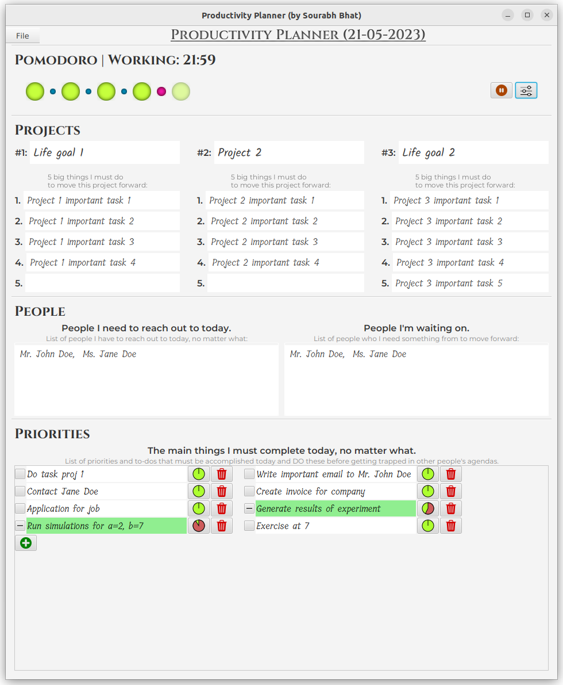
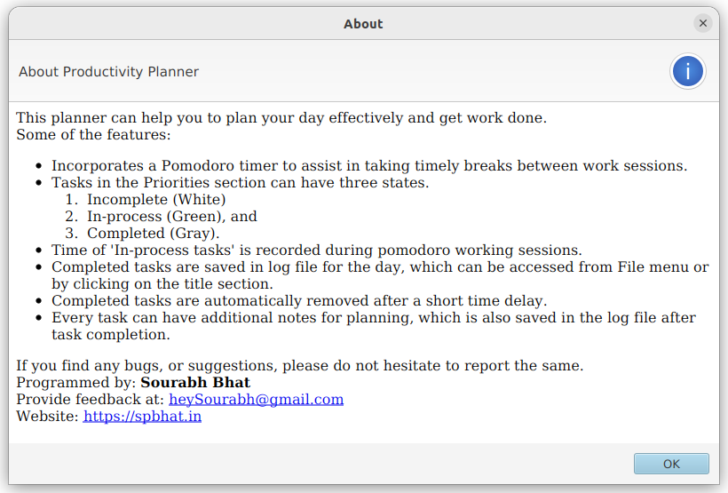
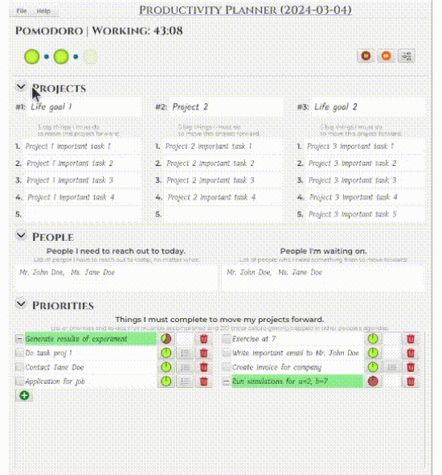
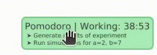

# PersonalDailyPlanner
A personal daily planner which helps me to plan my days effectively and keeps
me motivated.

The `run.sh` script can be used to launch the program. 
Put it in your startup to launch every day automatically.
Download javafx for your operating system from https://openjfx.io/ website 
and change the paths in the `run.sh` script file accordingly.

At present, you need to compile the Java source files using a JDK. 
Probably in the future [Launch Multi-File Source-Code Programs](https://openjdk.org/jeps/8304400) 
will allow to run directly from the source.

## Trial run:

Help dialog:

Collapsable sections, so that the details can be 
**hidden away to avoid distraction**:

Floating widget, useful as reminder for currently in-process tasks:

The widget can be placed anywhere on the screen with the main planner window minimized.
